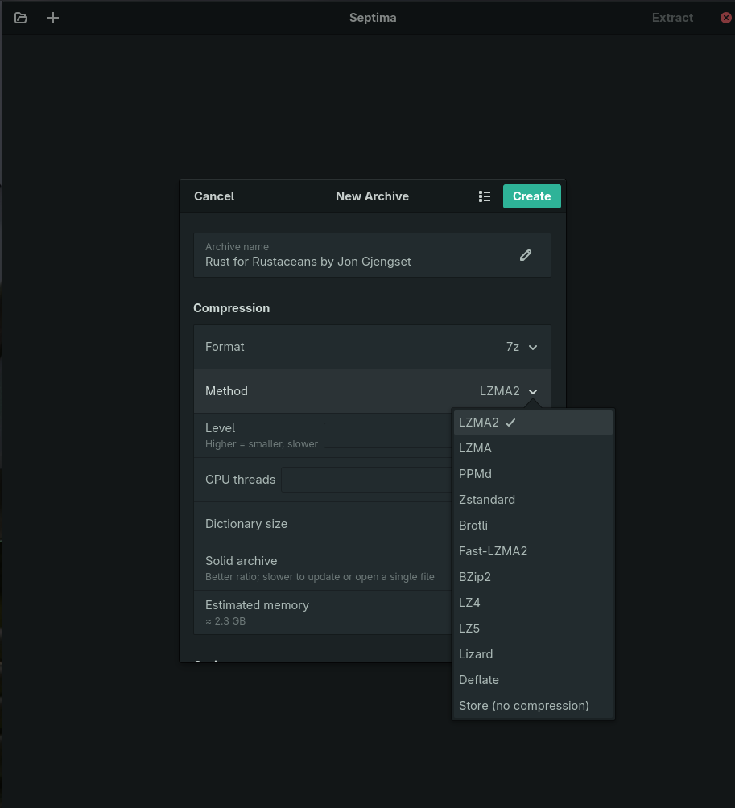
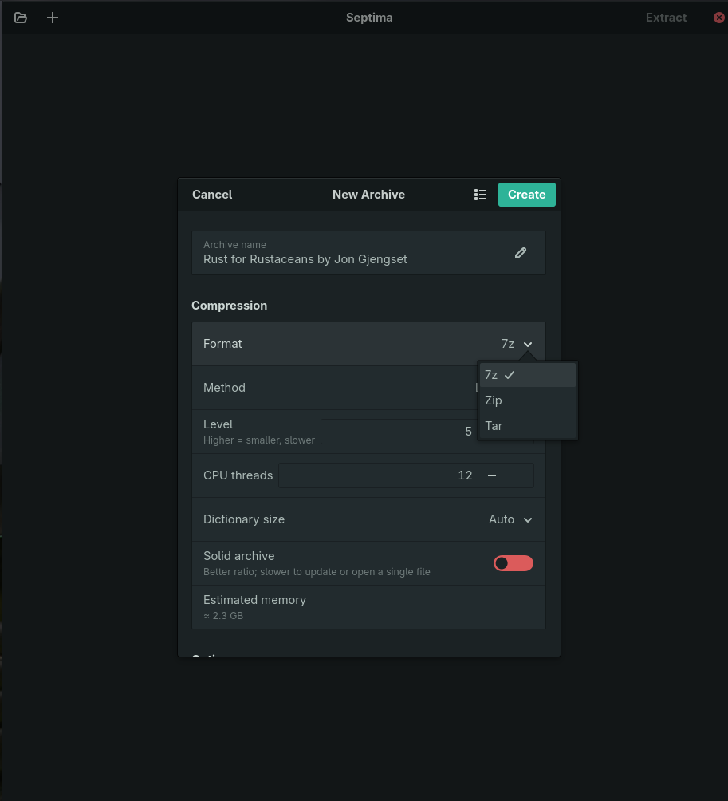
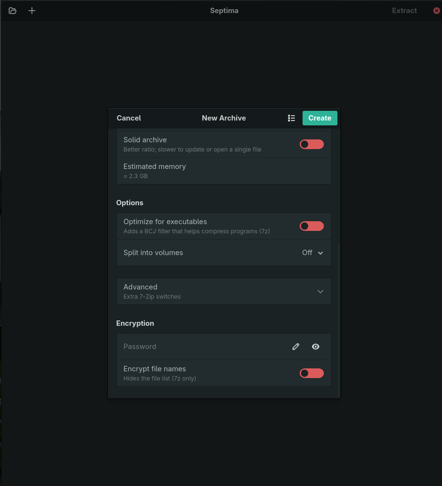

<p align="center">
  
</p>

<h1 align="center">Septima</h1>

<p align="center"><strong>The archive tool that actually speaks modern-codec 7z — with a real compression-tuning UI.</strong></p>

Septima is a GTK4 / libadwaita front-end for [7-Zip ZS](https://github.com/mcmilk/7-Zip-zstd)
(`7zz`) on Linux. It is a GNOME-native app built specifically around modern
compression codecs — **Zstandard, Brotli, Fast-LZMA2** — with the kind of
codec-tuning controls no other Linux archive manager exposes.

It is an **archive tool, not a file manager**. It never links or vendors 7-Zip
code: a UI-free engine crate supervises the `7zz` binary as a subprocess.

> Status: early but working. Browse, extract, and create-with-tuning all
> function today in a sandboxed Flatpak. See the [roadmap](#roadmap).

<p align="center">
  
</p>

---

## Why Septima?

Modern-codec 7z with a tuning UI, in a GNOME-native app, is a gap nothing else fills:

| | Modern codecs (zstd/brotli/flzma2) | Real compression tuning | GNOME-native GUI | One-gesture `.tar.zst` |
|---|:---:|:---:|:---:|:---:|
| **File Roller / Ark** | ✗ | ✗ | ✓ / KDE | ✗ |
| **PeaZip** | partial | ✓ | ✗ (Qt) | partial |
| **7-Zip CLI / `7zz`** | ✓ | ✓ (flags) | ✗ | ✗ (two-step) |
| **Septima** | ✓ | ✓ | ✓ | ✓ |

Where Septima aims to *win*, not just match:

- **A real Add-to-Archive dialog** — format × codec × level, with the level range
  reacting to the codec (zstd 1–22, brotli 0–11, …), dictionary size, solid mode,
  threads, and a **live memory estimate** so you can see the cost before you commit.
- **"Optimize for executables"** — one switch for the BCJ filter, instead of the
  `-m0=bcj` folklore the Windows tool makes you learn.
- **Transparent modern tarballs** — create a real `.tar.zst` / `.tar.xz` in one
  gesture (transparent *browsing* of them is on the roadmap).

## Features

- Browse any archive `7zz` can read (7z, zip, tar, xz, gzip, bzip2, zstd, rar…)
  in a details view: Name / Size / Packed / Method / Modified / CRC.
- Open an archive from the file chooser, your file manager ("Open With"), or by
  **dropping it onto the window**.
- Extract with **live progress, cancel, and password** support.
- **Create / Add to Archive** with full tuning:
  - Formats: **7z, zip, tar** (+ tar → zstd/xz/gzip/bzip2).
  - Codecs: LZMA2, LZMA, PPMd, **Zstandard, Brotli, Fast-LZMA2, LZ4, LZ5, Lizard**,
    BZip2, Deflate, Store.
  - Level, dictionary size, solid mode, CPU threads, live memory estimate.
  - Executable-optimization (BCJ), free-text advanced parameters.
  - Encryption (AES-256) with optional encrypted file names (7z).
  - Split into volumes (`.001`, `.002`, …).
- Ships as a **Flatpak** with `7zz` bundled — **portals only, no host filesystem
  access** by design.

<table>
<tr>
<td width="50%"><br><em>Reactive tuning — level ranges follow the codec, with a live memory estimate.</em></td>
<td width="50%"><br><em>Executable optimization, split volumes, advanced switches, and encryption.</em></td>
</tr>
</table>

## Power-user switches

The create dialog's **Advanced → parameters** field is a free-text escape hatch:
whatever you type is passed straight to `7zz a`. It's for the long tail of
7-Zip's `-m` (method) and `-s` (store) switches that don't each earn a control.
A few of the useful ones:

**Codec fine-tuning**

| Switch | What it does |
|---|---|
| `-mfb=273` | Fast bytes / word size (LZMA/LZMA2, 5–273) — the biggest ratio knob after level |
| `-mmf=bt4` | Match finder (`hc4` / `bt2` / `bt3` / `bt4`) — speed vs ratio |
| `-mo=32 -mmem=256m` | PPMd model order / memory |
| `-mlc= -mlp= -mpb=` | LZMA literal-context / position bits (rarely needed) |

**Filters / architecture** (beyond the "Optimize for executables" switch)

- `-m0=ARM64 -m1=lzma2` — arch-specific executable filter (also `ARM` / `ARMT` / `PPC` / `SPARC` / `IA64`).
- `-m0=Delta:4 -m1=lzma2` — fixed-stride data (audio, tables, bitmaps).

**Metadata / storage**

- `-snl` — store symlinks *as links* (otherwise 7-Zip follows them). Handy on Linux.
- `-mtc=on -mta=on` / `-mtm=off` — store creation/access times, or drop mtime.
- `-ms=e` / `-ms=100m` — solid *by extension* / solid *block size*.
- `-mem=xchacha20poly1305` — new encryption methods, where the bundled `7zz` supports them.

**Behavior:** `-w<dir>` (working dir) · `-slp` (large pages) · `-u…` (update rules).

> Switches here are appended after the dialog's own options, so they override
> them. Params are split on spaces, so avoid switches containing spaces for now.
> Full list: [7-Zip command-line switches](https://documentation.help/7-Zip/).

## Install

### Flatpak bundle

Download **`Septima.flatpak`** from the
[latest release](https://github.com/superuser-miguel/septima/releases/latest),
then:

```sh
flatpak install --user ./Septima.flatpak
flatpak run io.github.superuser_miguel.Septima
```

> The bundle is a direct install — to update, download the newer release and
> reinstall. A self-hosted Flatpak repo with automatic updates (via a
> `.flatpakref`) is planned.

## Build from source

Septima builds and runs entirely inside the GNOME Flatpak sandbox.

```sh
flatpak install flathub org.gnome.Platform//50 org.gnome.Sdk//50 \
    org.freedesktop.Sdk.Extension.rust-stable//25.08
flatpak-builder --user --install --force-clean build-dir \
    build-aux/io.github.superuser_miguel.Septima.Devel.json
flatpak run io.github.superuser_miguel.Septima.Devel
```

For host development (needs `gtk4-devel`, `libadwaita-devel`, `blueprint-compiler`,
Meson, and `7zz` on `PATH`):

```sh
meson setup builddir -Dprofile=development
meson compile -C builddir
```

## Roadmap

### Shipped

- [x] **Browse & extract** — any archive `7zz` reads, with live progress, cancel
      and password support.
- [x] **Create with full tuning** — format × codec × level, dictionary, solid,
      threads, live memory estimate, BCJ, volumes, encryption, advanced switches.
- [x] **Transparent nested browse + extract** — open, browse and extract a
      `.tar.zst` / `.tgz` / `.tar.xz` in one gesture, both ways.
- [x] **Named compression presets** — save and reuse tuning profiles.
- [x] **Staged input list** — Add Files / Add Folder across locations, per-item
      remove, and drag-and-drop from the file manager.
- [x] **Drop-to-open** — drag an archive onto the window to open it.
- [x] **Hash calculator** — CRC-32, SHA-256/512, SHA3-256, BLAKE3, xxHash, with
      copy and verify-against-a-checksum.
- [x] **Honest progress on big jobs** — an indeterminate "Scanning…" state while
      `7zz` enumerates the input, so a large selection no longer sits at 0%
      looking frozen.
- [x] **Responsive cancel** — Cancel takes effect in well under a second even
      while `7zz` is silent, and the half-written archive is deleted rather than
      left behind looking complete.

### Next up

- [ ] **Post-extract actions** — a "Show in Files" action and an optional
      "delete the archive afterwards" toggle.
- [ ] **Generate a checksum file** — optionally write a `.sha256` / `SHA256SUMS`
      alongside a newly created archive (builds on the hash calculator).
- [ ] **In-archive edit** — delete / rename entries, plus the "Test archive"
      (`t`) action.
- [ ] **Self-hosted Flatpak repo** — a signed OSTree repo + `.flatpakref` so
      `flatpak update` pulls new releases directly (currently a manual `.flatpak`
      download; infra work planned for late July).

### Later

- [ ] **Drag-out to extract** — drag entries out of an open archive to a folder
      to extract them (needs a drag source with on-demand extraction; drag-*out*
      support under Wayland / portals is the open question).
- [ ] **Promote key Advanced switches to real controls** — symlink handling
      (`-snl`), word size / fast bytes (`-mfb`), update modes (`-u`).
- [ ] **Free-space check** — show available space at the extract destination
      before starting.
- [ ] **Lizard family × level picker.**
- [ ] **Custom visual styling and app icon.**
- [ ] **More encryption methods** — XChaCha20-Poly1305, AES+XChaCha20 and
      friends via `-mem`, *blocked until* the bundled 7-Zip ZS ships them
      ([mcmilk/7-Zip-zstd#505](https://github.com/mcmilk/7-Zip-zstd/pull/505)).

## Acknowledgements

- **[7-Zip ZS](https://github.com/mcmilk/7-Zip-zstd)** by Tino Reichardt — the
  `7zz` binary Septima bundles and drives, which extends **7-Zip** by Igor Pavlov
  with Zstandard, Brotli, LZ4/LZ5, Lizard and Fast-LZMA2. Septima is *not* a fork
  of it; it is bundled unmodified as a separate Flatpak module.
- Built with **[gtk4-rs](https://gtk-rs.org/)**, **libadwaita**,
  **[Blueprint](https://gnome.pages.gitlab.gnome.org/blueprint-compiler/)**, and
  **Meson** — following the conventions of Amberol, Fractal and friends.

## License

Septima is **GPL-3.0-or-later**. The bundled 7-Zip ZS remains its own
LGPL-2.1-or-later / BSD-licensed work, built as a separate module.
